## 第 1 页

数学知识
数学部分包括线性代数、概率论、高等数学、离散数学，一般在夏令营面试中前两门课程是
最容易抽中的。
在准备数学知识，如果时间还长，则推荐重新复习线性代数和概率论这两门课程，高等数学
和离散数学一是太多，二是不容易被老师问道，直接背诵常见的问题即可。但如果所剩时间
不多，则四门数学课程都可以直接背诵常见题目。
复习建议
线性代数
线性代数复习综述
可以看保研当年的汤家凤老师的线性代数考研视频，汤老师的讲解非常细致，基础阶段
的精讲就够用了，汤老师手把手教授跟着走，一节课40 分钟左右，总共不超过30 节课，一
周肯定可以看完，书籍可以搭配自己的本科书籍，也可以在网盘资源进行下载相关的考研书
籍【也许到时候可以提供相关的考研视频和书籍资源】。
这个过程不要求能够进行计算，但是要搞清楚线性代数讲了什么，各个章节中提到的学
术名词的含义和之间的关系，可以转为成自己的理解说出来，例如矩阵和向量的关系，他们
的极大无关向量组分别是指的什么，线性相关、线性无关又有什么意义，在实际应用中有什
么具体含义等等。
概率论
概率论复习综述
这里也推荐一位考研老师的视频，余炳森老师的概率论课程，时长长度和汤家凤老师的
差不多，讲授方式也是手把手教，很细致，但每个视频包含很多的计算内容，可以直接跳过。
概率论相较于线性代数更容易理解和复习，所以对于容易理解的章节也可以选择性的跳
过，节省时间。但是大数极限定律及中心极限定理、参数估计这部分的含义很重要，建议仔
细听各个定理的实际含义，容易混淆。常见的概率分布、离散型随机变量和连续型随机变量
及其概率密度、贝叶斯公式等等基础知识。

## 第 2 页

常见数学问题
线性代数
1.
*矩阵的秩，满秩代表什么？不满秩呢？★★★★★
参考资料：《线性代数成立波》56 页
矩阵的秩的两种解释：1.经过矩阵变换后的维度；2.列空间的维度，列空间是由列向量
所张成的空间；3.一个矩阵A 的列秩是A 的线性独立的纵列的极大数目。类似地，行秩是A
的线性无关的横行的极大数目。
满秩代表矩阵的每一行都有一个主元，表明线性方程组一定有解，且所生的向量也为n
维。
不满秩与上述相反，说明至少有一行不存在主元，若存在一行全0 则说明所形成的线性
方程组有无穷多个解，若最后一列为非0 且是非线性方程组无解。
矩阵A 的不等于零的子式的最高阶数称作矩阵A 的秩。
一个秩为n 的矩阵满秩意味着存在一个n 阶子式不为0。
不满秩的话，假设其秩为r，意味着所有大于r 阶的子式都为0。
2.
*什么是线性相关？什么是线性无关？★★★★★
线性相关：一组数据中有一个或者多个量可以被其余量表示。
线性无关：于线性相关相反，也叫线性独立。
对于线性空间中的n 个向量，假如存在n 个常数使得这n 个常数与n 个向量对应乘积加
合等于0，则称这n 个向量线性相关，如果不存在这样的n 个常数，称之为线性无关。
参考资料：《线性代数成立波》65 页
3.
*什么是向量空间？线性空间？★★★★(0703 赵轲)
凡是具有加法结构和数乘结构的集合都可以叫做线性空间。向量空间指一个有线性运
算规的集合，集合的元素可以称为向量，规则是线性运算（即加法和数乘一般性数学定理）。
向量空间通常特指由向量构成的线性空间。
所有n 维向量构成的集合称为n 维向量空间。
将n 维向量空间抽象化，便引出线性空间的概念。定义集合V 上的两种代数运算：加法
和数乘。V 中任意两向量之和与V 中的一个向量gamma 对应；V 中任意向量和域K 中的任一
数lambda 的数乘与V 中的一个向量eta 对应。
并且加法满足交换律、结合律、零元、逆元，数乘存在单位元、满足结合律，数乘关于
加法满足分配律。
那么这个集合V 就称作线性空间，又叫向量空间。V 中的元素统称为“向量“。
参考资料：《线性代数与矩阵论许以超》书不好找，直接放截图了
这里的“纯量积”其实就是数乘：常数乘向量（伸缩变换）

## 第 3 页

4.
*什么是向量的基？★★★
在线性空间V 中可以找到n 个向量，这n 个向量线性无关，并且线性空间V 中的任意一
个向量都和这n 个向量线性相关，那么这n 个向量就称作线性空间V 的基。
参考资料：《线性代数与矩阵论许以超》书不好找，直接放截图了
5.
*什么是向量正交？什么是矩阵正交？★★
正交向量组中，任意两个向量的数量积为0。
正交矩阵的每一列都是一个单位向量，并且任意两列求数量积都为0。
两个矩阵正交，表示这两个矩阵相乘结果为单位矩阵。

## 第 4 页

参考资料：《线性代数成立波》118 页
6.
*高斯分布(正态分布) ★★★★
一个随机变量如果是由大量微小、独立的随机因素的叠加结果，那么这个变量一般都可
以认为服从正态分布。
正态分布曲线关于其均值点对称，标准差越大图像越扁平。
参考资料：《概率论与数理统计茆诗松》截图
7.
线性方程组的解，Ax=b，Am×nAm×n 分别为长矩阵和扁矩阵？怎么确定哪
个解是最优解？★★★★
8.
*什么相似矩阵？什么是正定矩阵？★★★★
对于两个矩阵A、B，如果存在一个矩阵P，使得矩阵P 的逆乘矩阵A 乘矩阵P 等于
矩阵B，那么矩阵A 相似于矩阵B。相似矩阵A 和B 它们的特征值相同。
参考资料：《线性代数成立波》124 页
假如一个实对称矩阵S 对于任一n 行1 列的矩阵alpha 都有alpha 的转置乘矩
阵S 乘alpha 都大于0，则该矩阵正定。
参考资料：《线性代数与矩阵论许以超》截图：

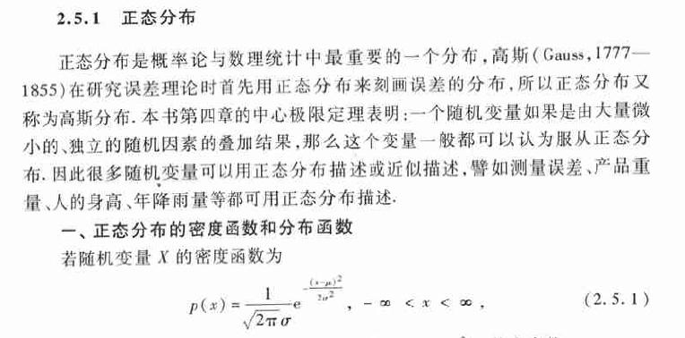

## 第 5 页

正定矩阵
- 前提：矩阵是对称的
- 所有特征值大于零
- 各阶主子式大于零
1、求出A 的所有特征值。若A 的特征值均为正数，则A 是正定的；若A 的特征值均为
负数，则A 为负定的。
2、计算A 的各阶主子式。若A 的各阶主子式均大于零，则A 是正定的；若A 的各阶主
子式中，奇数阶主子式为负，偶数阶为正，则A 为负定的。
9.
*矩阵范数（一阶二阶范数）★★★★
矩阵范数是一个满足非负性、齐次性、三角不等式以及相容性的函数。
矩阵一范数就是矩阵所有元素取绝对值，然后求最大列和。
矩阵A 的2 范数就是“矩阵A 的转置与矩阵A 相乘所得矩阵”的最大特征值。
参考CSDN：https://blog。csdn。net/weixin_28972529/article/details/113452038

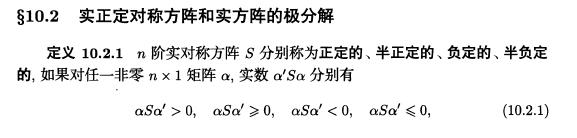

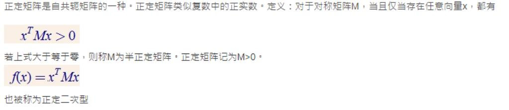

## 第 6 页

10. *矩阵的特征值与特征向量有什么关系？特征值特征向量的含义和作用？
★★★★
矩阵的特征向量是这样的向量：矩阵作用于该向量后，向量保持方向不变，进行某一比
例的伸缩变换，而这个比例就是特征值。
因此，特征值与特征向量的关系就是，特征向量与特征值进行数乘操作后所得的向量，
和矩阵对该向量进行变换所得向量相同。
因此特征值的含义就是和矩阵具有同等变换效果的常数，而特征向量就是与矩阵作用之
后保持方向不变的向量。
作用：特征值可以用于奇异值分解、主成分分析。可以用于谱分解、特征值分解。
参考资料：https://www。zhihu。com/question/21874816/answer/181864044
11. *矩阵运算下Ax=b 中什么情况下x 有解★★
线性方程组Ax=b 的充要条件是，系数矩阵A 和增广矩阵B 的秩相等。
假如线性方程组Ax=b 有解，那么在m>=r=rank(A)的情况下它的通解依赖于m-r 个独立
参数，当m=r 时具有唯一解。
m 个未知数，n 个线性方程的齐次线性方程组必有零解，齐次线性方程组有非零解的充
要条件是其系数矩阵A 的秩<m，而且通解有无穷多个解，依赖于m-r 个独立参数。
齐次线性方程组有m-r 组解，这m-r 组解就是齐次线性方程组的基础解系。
非齐次线性方程组解的通解由相伴的齐次线性方程组的通解和非齐次线性方程组的一
个特解组成。
12. *什么是张量？张量与矩阵有什么区别？★★
张量可以看作标量、向量、矩阵的推广，矩阵是二阶张量，而标量是0 阶张量、矢量是
1 阶张量。
参考链接：https://www。zhihu。com/question/22189865

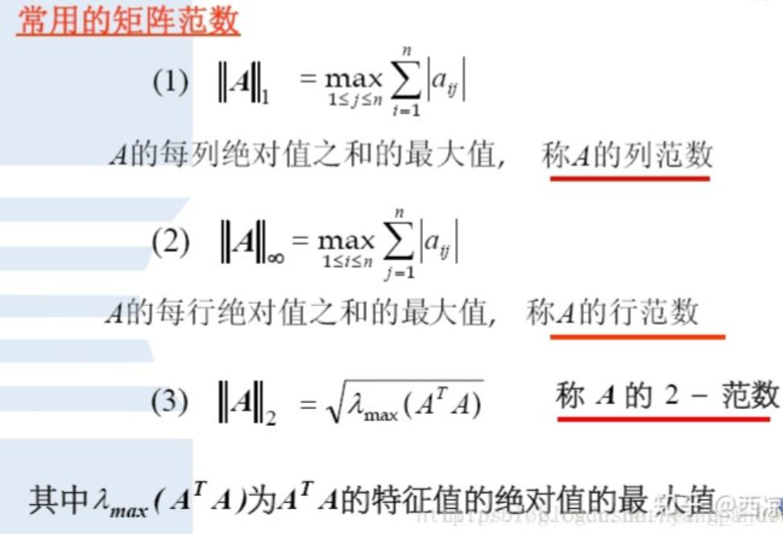

## 第 7 页

13. 初等行变换的三种变换？
14. 化为阶梯形或简化阶梯形的步骤，也叫行化简算法？
1、交换两行（如果化行最简型时非0 首元不为1，可以进行列交换）
2、用k(k≠0)乘某一行，或做提公因式使用。——将某行首元化1
3、某一行的L 倍加到另一行上去（常用，L 可正可负）——倍加化0.
15. 1 行2 列的列向量和矩阵表达形式有何不同？
(1,2)===>[1,2]
16. 向量的线性组合==矩阵与向量的积？
前者称向量方程，后者称矩阵方程，另也可理解为：线性方程组
17. 相容方程组和解集表示成参数向量的形式？
P60(pdf)
18. 线性无关？
向量方程仅有平凡解，零向量是线性相关的（因为该零向量的系数可以为任何值，其余值无
所谓）。P69(pdf)
19. 线性相关集种某个向量可能不是其它向量的线性组合
1 2 0
0 0 1 如：第一个向量为0.
20. 当矩阵是长方形时线性相关，因为一定存在自由变量。
21. 可逆矩阵即非奇异矩阵，不可逆矩阵即奇异矩阵，矩阵的逆是唯一的，行列
式不为0。
22. 线性方程组如何求解？
克莱姆法则【两个前提，一是方程的个数等于未知量的个数，二是系数矩阵的行列式要
不等于0】

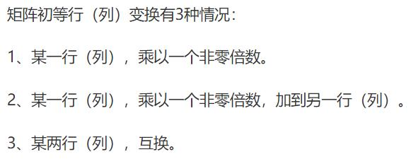

## 第 8 页

概率论
1.
*变量与随机变量有什么区别？★★
随机变量是用来量化随机事件的函数。随机变量能够描述随机现象，并通过概率统计
的方法进行分析。而变量通常用来描述确定性的现象。
变量的取值是固定唯一的，并且取值范围是整个定义域。而随机变量取值有多个，而且
每个取值都有一定的概率。在试验之前，随机变量的取值是不能预知的，试验之后，随机变
量的取值范围就是这次试验的样本空间。
参考《概率论与数理统计浙大第四版》31 页
2.
*随机变量与概率分布有什么联系？★★
随机变量的分布函数表述了随机变量的统计规律性，已知一个随机变量的分布函数就
可以得知该随机变量落在某一区间的概率。
参考《概率统计浙大第四版》39 页
3.
*联合概率与边缘概率有什么区别？有什么联系？★★
区别：
联合概率是基于两个随机变量及其相互作用的样本空间的概率。
边缘概率是多维随机变量的样本空间中，某一个或多个随机变量构成的子空间的概率。
联系：
在联合概率的基础上固定若干个随机变量的取值便得到边缘概率。
参考资料《浙大第四版》60 页
4.
*常见的概率分布有哪些？有什么应用场景？请举例说明★★
离散分布：
二项分布：n 重伯努利检验，常用于检查产品合格率、色盲率调查等等
两点分布（01 分布）：比赛胜率估计
泊松分布：单位时间内或单位空间中事件数量的频数分布。常用于一天内到达顾客数、
铸件上的砂眼数、一天内电路受到电磁波干扰次数等等
超几何分布：用于进行有限总体中进行不放回抽样。
几何分布：一次伯努利试验中事件A 首次出现时的试验次数。例如产品不合格率调查。
连续分布：
均匀分布：
正态分布：主要应用于统计理论、误差理论等等
指数分布：建模各次事件之间的时间分布情况。常用于随即服务系统、寿命估计、排队
论等等
参考《概率论与数理统计》
(27 条消息) 《商务与经济统计》学习笔记（七）—各统计分布知识点归纳_天
阑之蓝的博客-CSDN 博客
5.
*大数定律和中心极限定理的意义与作用（切比雪夫大数定律）★★★★
浙大第四版：
切比雪夫大数定律：只要随机试验的次数n 充分大，样本均值趋近于总体均值，指明了
平均结果的渐趋稳定性。

## 第 9 页

辛钦大数定理：说明了对于独立同分布且具有均值u 的n 个随机变量，当n 很大的时候
它们的算术平均值依概率收敛于u。样本均值稳定于数学期望。
伯努利大数定律表明只要随机试验的次数n 充分大，那么事件A 频率和概率的绝对偏差
很小，说明在实际应用中，试验次数很大的时候可以用事件的频率来替代事件的概率。频率
稳定于概率。
参考《浙大第四版》120 页
独立同分布的中心极限定理：均值为u，标准差为sigma 的独立同分布的n 个随机变量
之和的标准化变量在n 充分大的时候近似服从于标准正态分布。大量独立同分布的随机变量
和的极限分布服从标准正态分布。
由此推论均值为u 标准差为sigma 的独立同分布的n 个随机变量的算术平均值，当n
充分大的时候近似服从均值为u 方差为sigma^2/n 的正态分布。
李雅普诺夫定理：独立的n 个随机变量，其随机变量之和的标准化变量很大的时候近似
服从与标准正态分布。
棣莫弗-拉普拉斯定理表明正态分布是二项分布的极限分布。
参考《浙大第四版》121 页
6.
*正态分布的和还是正态分布吗，正态分布性质与独立同分布）★★★★★
彼此独立的正态分布的和仍然是正态分布，这叫做正态分布的可加性。
正态分布的可加性就是：如果多个随机变量分别服从不同的正态分布，如果这些随机变
量彼此独立，那么这些随机变量的和也服从正态分布。
事实上，独立同分布的正态分布随机变量具有线性性质，证明过程参考下图：

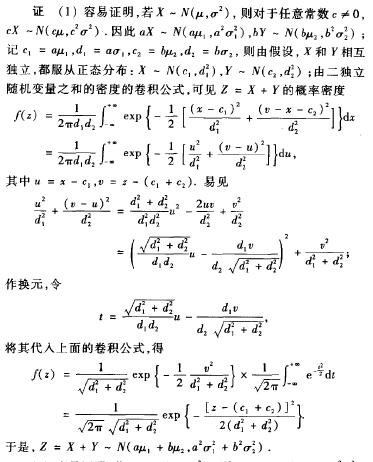

## 第 10 页

7.
*什么是假设和检验？★★
用来判断样本与样本、样本与总体的差异是由抽样误差引起还是本质差别造成的统计推
断方法。
假设检验的基本思想是“小概率事件”原理，其统计推断方法是带有某种概率性质的反
证法。小概率思想是指小概率事件（此小概率也称：检验的显著性水平，一般取0.05，0.01，
0.1）在一次试验中基本上不会发生。反证法思想是先提出检验假设，再用适当的统计方法，
利用小概率原理，确定假设是否成立。即为了检验一个假设H0 是否正确，首先假定该假设
H0 正确，然后根据样本对假设H0 做出接受或拒绝的决策。如果样本观察值导致了“小概率
事件”发生，就应拒绝假设H0，否则应接受假设H0。
假设检验问题关注于通过试验来判断是否参数theta 是否落在参数空间的某一个子集
或者其补集里面。在总体分布函数未知或者只知其形式不知其参数的情况下，为了推断某些
参数，提出关于总体的假设，然后通过样本来决定对所做出的假设接受或者拒绝。假设检验
就是做出这一决策的过程。
假设就是关于总体的参数的参数空间的一部分，包括原假设和备择假设。这两个假设互
补。而检验就是对于假设检验问题满足某一显著性水平的概率的不等式。通过这一不等式
来判断某一估计是否满足需求。
参考1《Probability and statistics》
参考2《概率论与数理统计茆诗松》

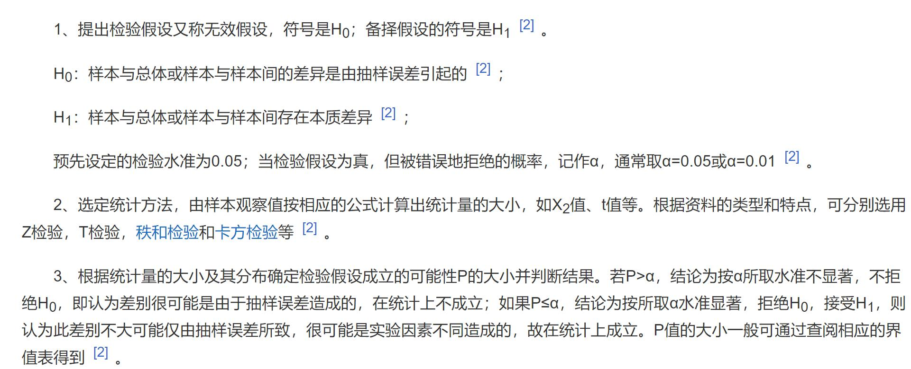

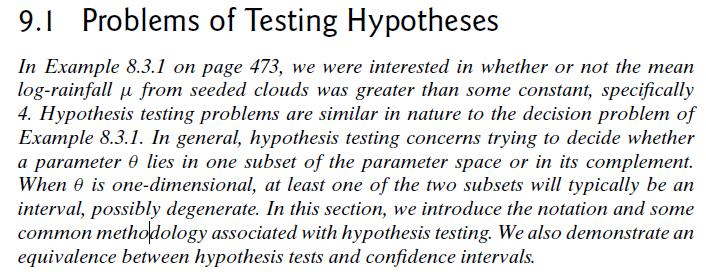

## 第 11 页

8.
*数学期望和方差？★★
随机变量的数学期望就是随机变量每个取值于该取值的概率的乘积的累加和。它描述
了随机变量的集中特性。
而随机变量的方差描述了随机变量的波动特性，即离散特性，其定义是随机变量的每个
取值和数学期望的偏差平方和与该取值的概率的乘积的连加和。随机变量在均值附近的分散
程度。
参考：根据公式的理解
9.
*独立和不相关的区别？★★
见下图，概括就是：独立一定不相关，而不相关不一定独立。例如线性不相关的随机
变量可能是非线性相关。最常见的例子就是Logistics 函数或者二次函数，自变量和因变量
计算所得相关系数很低，但是是互相依赖的变量。
10. *概率密度函数？★★
连续随机变量的一切取值充满整个样本空间，而这其中有无穷个不可列的实数，因此无
法采用分布列表示，采用概率密度函数表示。
概率密度函数能在一定程度上反应随机变量X 在某点附近取值的概率大小，但概率密度
函数不是概率，乘以区间长度微元后就表示概率的近似值，而概率密度函数在一段区间上
的积分就是随机变量X 在这段区间上取值的概率。因此，如果存在实数轴上的一个非负可积
函数使得对任意实数x 都有“这个函数从负无穷到x 的积分值就是随机变量X 的分布函数
F(x)”，这个函数称为随机变量X 的概率密度函数。
参考《概率统计茆诗松》69 页

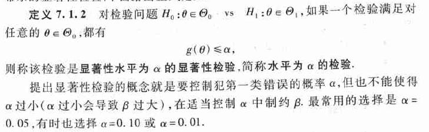

## 第 12 页

11. *举几个泊松分布的例子★★
参考《概率论与数理统计茆诗松》
12. *说一下全概率公式和贝叶斯公式★★★★★★★
全概率就是表示达到某个目的，有多种方式（或者造成某种结果，有多种原因），问达
到目的的概率是多少（造成这种结果的概率是多少）？
全概率公式：
设事件
是一个完备事件组，则对于任意一个事件Ｃ，若有如下公
式成立：
那么就称这个公式为全概率公式。
贝叶斯公式就是当已知结果，问导致这个结果的第i 原因的可能性是多少？执果索因！
贝叶斯公式：
在已知条件概率和全概率的基础上，贝叶斯公式是很容易计算的：
13. *解释下相关系数、协方差、相关系数或协方差为0 的时候能否说明两个分
布无关？
所谓随机变量X 和Y 的协方差就是“X 的偏差和Y 的偏差乘积的数学期望”。若协方差
大于零，表示这两个随机变量呈正相关关系，若协方差小于零表示两个随机变量呈负相关关
系。而协方差等于零表示不“线性相关”。
相关系数可以看作标准化的协方差，它没有量纲，取值范围在[0，1]。
取值为0 不能说明两个分布无关，而是“线性不相关”，有可能存在非线性的相关关系，
也有可能取值毫无关联。

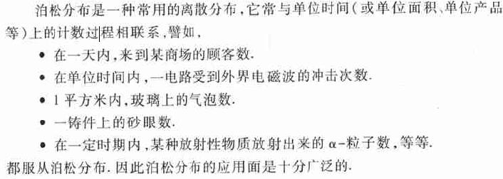

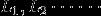

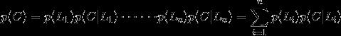

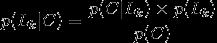

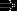

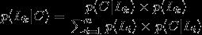

## 第 13 页

14. *若干正态分布相加、相乘后得到的分布分别是什么？★★★
相加参考6。
相乘：来自知乎：
正态分布相乘之后，服从的分布为：正态分布乘以常数
https://www.zhihu.com/question/46458824/answer/1658826258
知乎截图内容：
15. 假如有一枚不均匀的硬币，抛正面的几率是p，抛反面是1-p，请问如何做
才能得出1/2？★★★

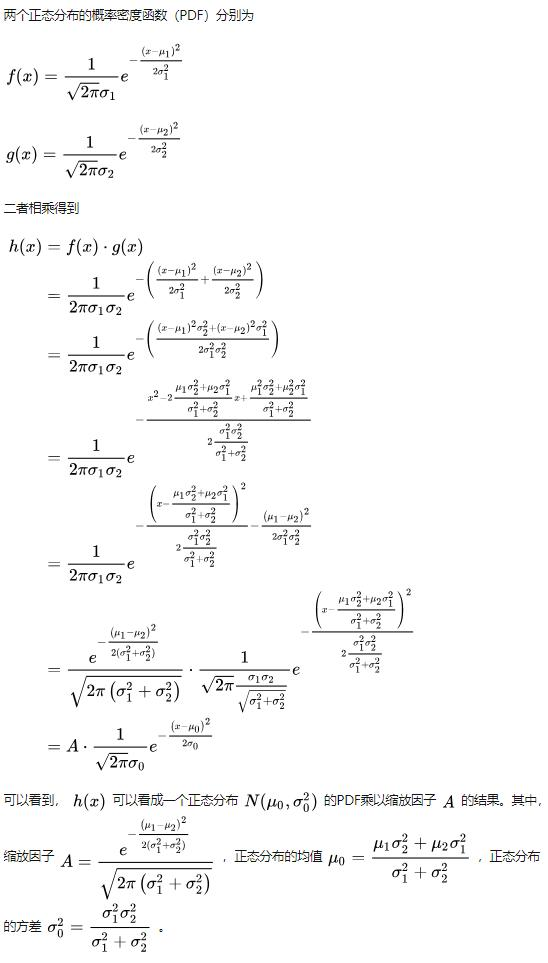

## 第 14 页

利用不均匀硬币产生等概率
16. *机器学习为什么要使用概率？★★
机器学习的是由数据驱动的方法，它的学习对象是数据，从数据出发提取数据特征，抽
象出数据模型又从数据中发现知识，最后回到数据的分析和预测中去。
机器学习算法的设计通常依赖于对数据的概率假设，如果不理解相关的数学知识，那么
久无法真正理解算法的精髓。并且，机器学习模型的训练和预测过程的评价指标——模型误
差，其本身就是概率的形式。
参考资料：https://www.zhihu.com/question/285189181
17. 什么是极大似然估计？★★★★★
通俗理解来说，就是利用已知的样本结果信息，反推最具有可能（最大概率）导致这
些样本结果出现的模型参数值。
18. 参数估计方法？
如何评价求出的估计量的好坏？
无偏性：即估计量求出来的参数可能偏高可能偏低，但总体的平均值等于未知参数θ，

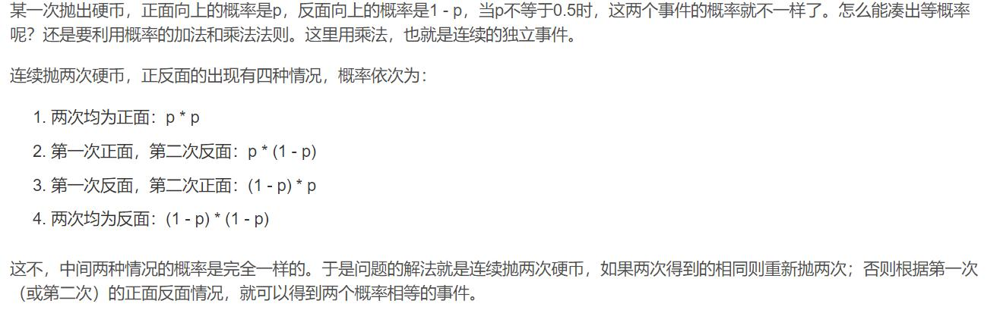

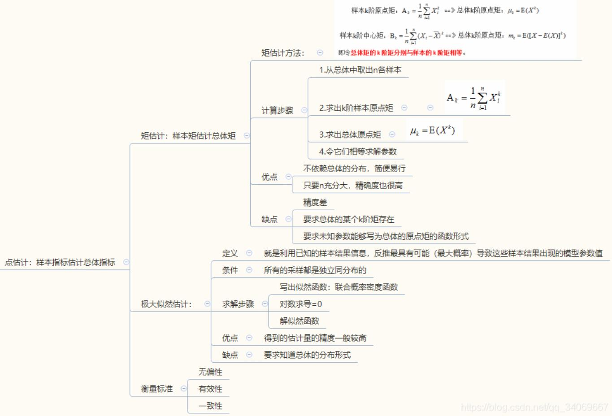

## 第 15 页

样本均值和方差分别为总体均值和方差的无偏估计量。
有效性：所估计出的参数在所构造的估计量中的方差要尽量小，即在参数θ附近的分散
程度要小。
一致性：当样本容量无限增大时，估计量能在某种意义下充分接近于被估计的参数。
区间估计：点估计有一定的精度，如果要反映出精度可以采用区间估计。即在某个区间内取
得参数θ的概率（即>=置信度）。利用伯努利大数定律，一个区间以一定的概率包含参数θ，
当试验次数无穷大时，频率接近于置信度。区间的长度意味着误差，与点估计互补，且与精
度相互矛盾，精度越大，区间长度越小。
经典面试题：
(21 条消息) 保研面试/考研复试概率论与数理统计问题整理_一匹好人呀的博
客-CSDN 博客_概率论与数理统计面试问题
(27 条消息) 数据分析面试【概率论与统计学】总结之-----统计学常见面试题
整理_天阑之蓝的博客-CSDN 博客_概率论与数理统计面试问题
19. 两事件相互独立与互不相容的关系：两者不能同时成立，如果两者相互独立
则一定相容，反之两者如果互不相容则两者要么不独立要么其中一件事情不
可能发生或者必然发生；因为若独立：P(AB)=P(A)P(B)>0,若互不相容：
P(AB)=0，互相矛盾。
20. 全概率贝叶斯公式中的先验概率和后验概率？、
先验概率（prior probability）
先验概率是指根据以往经验和分析得到的概率，如全概率公式，它往往作为”由因求果”
问题中的”因”出现的概率。
后验概率（posterior probability）
表示在事情已经发生的条件下，要求该事发生原因是有某个因素引起的可能性的大小。
后验概率是指在得到“结果”的信息后重新修正的概率，如贝叶斯公式中的。是“执果寻
因”问题中的”果”。
贝叶斯公式先验概率后验概率（详细）
21. 函数是分布函数充要条件？
F(x)是单调不减函数
分布函数是有界的，0<=F(x)<=1，左右极限分别为0 和1
分布函数是右连续的，但左连续不一定
22. 概率和统计的区别？
概率是已知模型和参数，推数据。统计是已知数据，推模型和参数。

## 第 16 页

23. 概率和似然的区别？
24. 离散型随机变量和连续型随机变量？
高等数学
1.
* 泰勒展开和傅立叶变换的概念以及他们在计算机领域中的应用
★★★★★★
为了便于研究复杂的函数，用多项式来近似表达函数可以简单地进行计算，而泰勒多项
式就是用多项式近似函数的一种方法，函数在某一点处展开为泰勒多项式就是泰勒展开。
泰勒多项式在计算机领域是数值分析的理论基础之一，数值微积分的很多定理和结论都
是由泰勒展开推导得出。
参考《同济第七版高等数学上册》第137 页泰勒公式
傅里叶变换和其逆变换是一对互逆的运算，是用于对函数进行变换的工具。傅里叶变换
可以将时域的非周期连续信号，转换为频域的非周期连续信号。
傅里叶变换的用途：在信号处理上，可以轻松地滤掉特定频率成分的波；在求解微分方
程上，可以让微分和积分在频率中变为乘法和除法；在计算机科学中，作为DFT 算法的理论
基础。

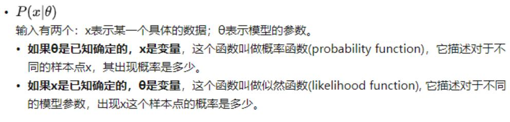

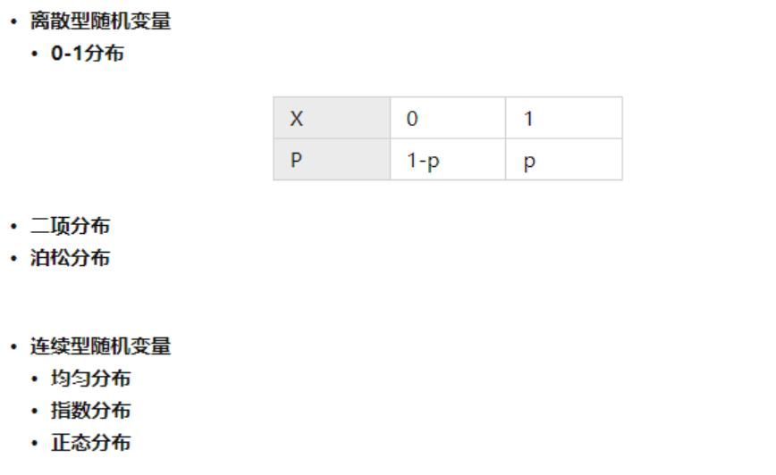

## 第 17 页

感兴趣可以参考：
https://zhuanlan.zhihu.com/p/19763358
2.
*傅里叶变换和傅里叶级数的区别★★★
傅里叶级数是一个函数的近似表达，是将一个函数通过三角函数系进行表达的表达式。
傅里叶级数仍然是一个函数。傅里叶级数拥有三角和复数两种表达形式。
而傅里叶变换是“函数的函数”，是一个对函数进行变换，使其拥有不同的特性，从时
域转换到频域的工具。傅里叶变换是从傅里叶级数的复数形式推导而来。
参考百度百科词条：“傅里叶变换”
3.
*函数零点和极值点怎么求？★★★★★
函数的零点求法：
首先是，解析解：令函数值等于0，然后解方程得到零点。
对于过于复杂无法求方程解的情况，使用数值方法：二分法、牛顿迭代法
极值点：
对函数求导，然后令导函数等于0，按照上述方法求导函数的零点即可，对于所得零点
判断解的两端导函数值的符号，
若两端同号，所得的解是驻点而不是极值点，
若两端异号，就是极值点。
4.
*判断两个无穷集合的大小，单射满射和双射的概念？★★★
判断无穷集合的大小要引入“势”的概念，在谈论这个问题之前，需要先说说双射的概
念。有穷集合和无穷集合相比的差别。
首先是，满射和单射。若A 到B 的函数满足“任一值域B 中的一个值都存在定义域A
中唯一的值与之对应”，这个函数就是单射的，若函数满足值域为集合B，就称函数时满射
的。
接着是，若函数既是单射的又是满射的，就称作函数是双射的，这意味着函数的定义域
为集合A，值域为集合B，且是单调函数。例如直线方程y=kx+b，是集合R->R 的双射函数，
例如函数y=tanx 是(0，1)->R 的双射函数。
参考《离散数学屈婉玲》137 页
无穷集合的大小通过集合的势来衡量，若是一个集合的势小于自然数集的势“阿列夫零”，
它就是有穷集。假如两个集合之间能够建立一一映射，那就是等势的，例如整数集、偶数集、
有理数集都和自然数集等势，也就是一样大小。而实数集和它任一子集都是等势的，且大于
自然数集。且康托定理指出，一个集合的幂集都大于当前集合。
5.
*欧氏距离及常见距离公式的缺点？★★★★★
欧氏距离也就是n 维空间中两点之间的线段长度。
1 欧氏距离的缺点在于，会受到数据尺度的影响而产生偏斜，需要对数据进行归一化后
使用。
2 余弦相似距离缺点在于只考虑了数据的方向，而没考虑向量的大小，受到数据尺度的
影响较大。
欧氏距离体现数值上的绝对差异，而余弦距离体现方向上的相对差异。
3 曼哈顿距离就是街道距离，缺点在于不够直观，并且距离不是最短距离。
参考资料：https://blog.csdn.net/Datawhale/article/details/113787498

## 第 18 页

6.
*最大似然估计是什么？★★★★★
该方法的直观想法就是，取到了某一样本值，那么就表明取到这一样本的概率较大，因
此认为取使得这一样本值的概率最大的参数值比较合理。
操作方法就是，固定样本的观察值，在参数的取值空间中挑选使得似然函数在该样本值
下达到最大值的参数，作为参数的估计值。
《概统浙大第四版》152 页
7.
*梯度方向导数与梯度下降？★★★★★
导数的本质：当自变量的变化量趋于0 时，函数值的变化量与自变量变化量比值的极限
偏导数：偏导数，指的是多元函数中，函数y 在某一点处沿某一坐标轴正方向的变化
率。偏导数其实是方向导数的一种特殊情况。
方向导数：某一点在某一趋近方向上的导数值，各个坐标轴的偏导数组成的向量，和
方向向量的内积。
梯度：是一个矢量，其方向上的方向导数最大，其大小正好是此最大方向导数( 函数沿
梯度方向有最大的变化率)。就是各个偏导数组成的向量。
《同济第七版高等数学下册》103 页
梯度下降法：既然在变量空间的某一点处，函数沿梯度方向具有最大的变化率，那么在
优化目标函数的时候，自然是沿着负梯度方向去减小函数值，以此达到我们的优化目标。从
函数的任一点开始，沿着该店梯度反方向运动一段距离，再沿新位置的梯度反方向运行一段
距离，如此迭代一直超着函数下坡最陡的方向运动，以此运动到函数的近似极小点。
参考资料：https://zhuanlan.zhihu.com/p/25387613
- 方向导数
- 方向导数是各个方向上的导数
- 梯度
- 偏导数连续才有梯度存在
- 梯度的方向是方向导数中取到最大值的方向，梯度值是方向导数的最大值
- 梯度下降
- 损失函数是一个自变量为算法的参数，函数值为误差值的函数，目的是找让误差值
最小时候算法取的参数
8.
*复合函数求导公式？给出函数让求？★★
首先是，复合函数的概念，复合函数就是多个函数构成的函数，它的求导法则就是“链
式法则”，如果某个函数由复合函数表示，则该复合函数的求导可以用构成复合函数的各个
函数的导数的乘积表示。
9.
*导数和偏导数的区别？★★
导数是针对一元函数的概念，即函数f 对自变量x 的导函数，又称导数、微商。
而偏导数是针对多元函数来讲的，多元函数对某一个自变量的导函数称作偏导数。
10. *可导、可微、连续、可积之间的关系（一元函数+二元函数）★★★
一元函数：
可微和可导互为充分必要条件，可导比连续，连续不一定可导，
连续必可积，可积不一定连续
二元函数：
可微必连续，连续不一定可微
若连续则二重极限存在，反之不成立
连续必可积，可积不一定连续。

## 第 19 页

参考资料：
《高等数学解题方法技巧归纳毛纲源下册》
《数学分析华师大上册》截图：
《数学分析》截图
11. *三个中值定理的区别、联系和物理意义（罗尔、拉格朗日、柯西）★★★
参考知乎：https://zhuanlan.zhihu.com/p/47436090
中值定理：揭示了函数在某段区间的上的整体性质与在该区间在某一点处的导数之间
的关系。
罗尔中值定理：函数f(x)在闭区间连续，开区间可导，区间端点函数值相等，必存在
一点导数值为0。
拉格朗日中值定理：函数f(x)在闭区间连续，开区间可导，必存在一点导数值等于端
点连线的斜率。揭示区间变化率与某点变化率的关系。
罗尔中值定理：函数f(x)和g(x)在闭区间连续，开区间可导，且任意一点g(x)导数值
不为0，必存在一点，f(x)导函数和g(x)导函数的比值，等于两函数区间端点函数值之差的
比值。
区别在于，罗尔定理要求区间端点函数值相等，拉格朗日中值定理则不要求。柯西中值
定理关系到两个函数。
联系在于，柯西中值定理当g(x)=x 的时候，退化为拉格朗日中值定理，拉格朗日中值
定理的区间端点函数值相等的时候，退化为罗尔中值定理。
物理意义在于，罗尔定理表明往复运动的始终必存在某一时刻速度为0。拉格朗日中值
定理表明一段物体从一个地方移动到另一个地方的始终，中间必有一点加速度为0。柯西中
值定理表明一段曲线运动的过程中，必有一点速度方向和位移方向相同。
12. 函数的阶是什么意思
有点相当于次数，次数越高，无穷小程度越高

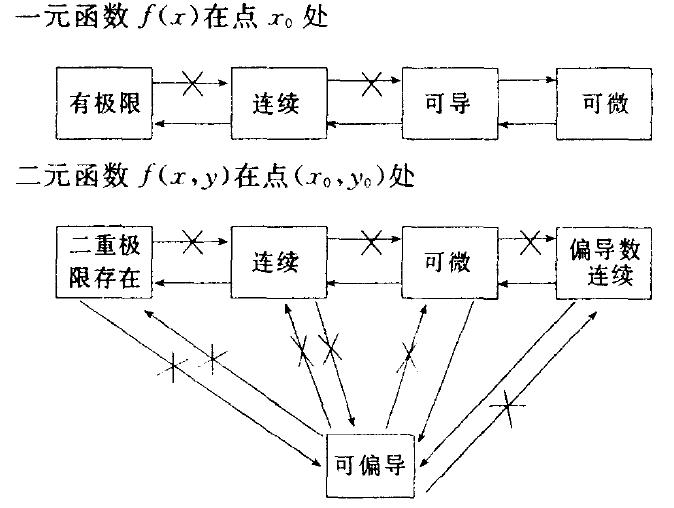

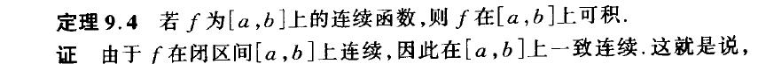

## 第 20 页

13. 说一下泰勒级数
14. 三个中值定理的区别、连续及物理意义
拉格朗日中值定理是罗尔中值定理的推广，柯西中值定理是拉格朗日中值定理的推广
离散数学
1.
*解释下什么是群环域？★★(赵轲)
由一个非空集合S 和该集合上的k 个运算组成的系统称作代数系统。群就是一个特殊的
代数系统，在这个代数系统的运算是可结合的二元运算，并且该系统中存在单位元和逆元。
环：若一个代数系统存在两个运算1 和运算2，集合R 关于运算1 构成交换群，关于运
算2 构成半群，并且运算2 关于运算1 适合分配律。则集合R 和这两个运算构成的代数系统
称作环。其中称运算1 为加法，运算2 为乘法。
域：如果一个环的乘法运算符合交换律，并且关于乘法运算存在单位元，并且对于环中
的任意两个非零元素执行乘法操作结果均不为0，那么这个环R 构成一个域。
参考：《离散数学屈婉玲》181 页

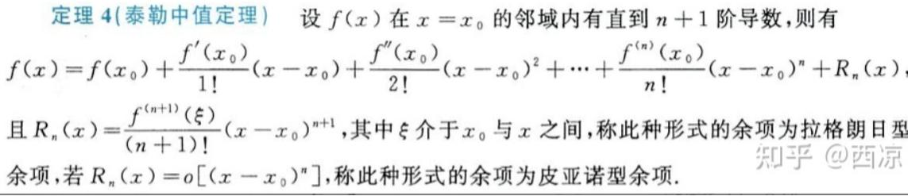

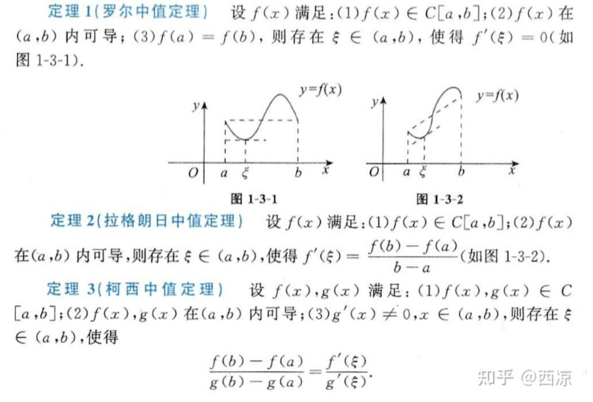

## 第 21 页

2.
*你知道哪些离散型随机变量★
0-1 分布：用于估计样本空间只有0、1 两个值的独立重复实验的概率。
二项分布：常用于样本空间只有两个值的独立重复实验地概率计算。
泊松分布：常用于服务系统，预测某一天某时段某服务台到达人数
几何分布：在n 次伯努利试验中，试验k 次才得到第一次成功的机率。
超几何分布：不放回抽样的概率计算。
参考《浙大第四版概率统计》
3.
*哈密顿图、欧拉图有什么区别，怎么求？★★★
所谓的欧拉图就是包含欧拉回路的图，欧拉回路就是能够通过图中所有的边一次且仅一
次就通过所有顶点的回路。也就是所谓的“能够一笔画的图”
而哈密顿图是经过所有顶点一次且仅一次。
欧拉图可以求出精确解，教材提到了两种算法：
Hierholzier 算法：
中心思想：欧拉图是由一个或多个回路拼接而成，只要把图中的每个回路的路径拼接起
来，就可以遍历这个欧拉图。
主要步骤：从一个可能的顶点出发，进行深度优先搜索，但是每次沿着辅助边从某个顶
点移动到另外一个顶点的时候，都需要删除这个辅助边。如果没有可以移动的路径，则将所
在结点加入到栈中并返回。
1.任选起始点并记录
2.从起点出发到达任一临接点，到达的点成为新的起点，删除经过的边
3.重复步骤2 直到回到初始点，此时到达步骤1，将本次记录的点集合与上次记录的点
集合拼接。若本图成为空图，到达步骤4。
4.输出所有记录点。
参考：https://blog.csdn.net/qq_40493829/article/details/108253637
Fleury 算法：
输入一个欧拉图
任取一个顶点，假设路径Pi=v0e1v1e2。。。eivi 已经行遍
然后开始在E(G)-{e1，e2，。。。，ei}中寻找邻接边，找边的规则为：
1.和当前顶点相关联。
2.除非无边可选，否则不选E(G)-{e1，e2，。。。，ei}中的桥
当已经无边可选了，算法停止，Pm=v0e1v1e2v2。。。emvm(vm=v0)为G 中一条欧拉回
路。
参考：https://blog.csdn.net/guomutian911/article/details/42105127
而哈密顿图，则至今没有一个高效地求出经确解地方法，暴力求解的话，这属于是
NP-Hard 问题，实际应用中，通常使用启发式搜索算法求出一个近似精确解，常用方法有：
禁忌搜索算法、蚁群算法、遗传算法等等。（CSDN 可搜）
4.
*欧拉图和欧拉函数★★★
所谓的欧拉图就是包含欧拉回路的图，欧拉回路就是能够通过图中所有的边一次且仅一
次就通过所有顶点的回路。也就是所谓的“能够一笔画的图”
参考《离散数学屈婉玲316 页》
数论的欧拉函数：和欧拉图无关，欧拉函数其实是初等数论的重要内容
其定义为：对自然数n，从0 到n-1 中与n 互素的数的个数就是欧拉函数phi(n)。

## 第 22 页

参考：《离散数学屈婉玲》
99 页计算方法证明382 页应用
5.
*哈夫曼树的定义，怎么求，应用？★
Haffuman 树：又称最优二叉树，假设给定有n 个权值的集合，且二叉树T 有n 个叶子
节点，将权值赋值给n 个叶子节点，定义二叉树的带权路径长度为权重和对应叶子节点的路
径长度乘积之和，而最优二叉树就是一组使得带权路径长度最短的权重配置方案作为权重的
二叉树。
Huffman 树的基本思想就是：带权路径长度最小的二叉树应该是权值大的外结点离根节
点最近的扩充二叉树。
计算方法：用n 个权重各创建一个平凡树，并赋该树根以权值，然后开始循环
循环内容：

选择树根权值最小的两个树

创建一个新树，左右子树分别是这两个权值最小的树

新树的树根权值为两树权值之和

删去原来的两个树，添加新树

判断，如果只剩一个树就跳出循环
应用：编码设计：Huffman 编码、决策算法、算法设计等。
参考《数据结构殷人昆第二版》241 页
6.
*无向图的定义★
无向图是一个有序二元组，二元组由一个非空有穷集——顶点集，和一个由顶点集的有
序积的有穷多重子集——边集所构成。无向图的边都是无序的，表示顶点和顶点的连接关系。
不同于有向边只表示单向关系。
参考《离散数学屈婉玲》273 页
7.
*解释下等价关系和等价类★★
如果非空集合A 上的一个关系R，同时满足自反性、对称性和传递性，就称R 为集合A
上的等价关系。
等价类就是集合A 中所有与x 等价的元素构成的集合。
参考：《离散数学屈婉玲》123 页
8.
极限存在但不一定连续（因为连续必须在点上有定义，但是极限科研没有定
义），连续一定存在极限。
9.
连续存在必须满足的三个条件？
a.在该点有定义；b.极限存在且等于函数值
10. 间断点类型？
第一类间断点（a.跳跃间断点：左右极限存在且相等；b.可去间断点：在该点无定义），第
二类间断点（无穷间断点：左右极限至少有一个不存在，）
11. 如何寻找间断点？没有定义的点，或分段函数的分界点

## 第 23 页

12. 介值定理？
闭区间[a,b]上连续，一定存在一点x 属于该区间使得f(x)=c(其中c 介于[f(a),f(b)])
跟的存在定理即零点定理（f(x)在区间[a,b]上连续，且f(a)·f(b)<0，则[a,b]必然存在
一点c 使得f(c)=0）
