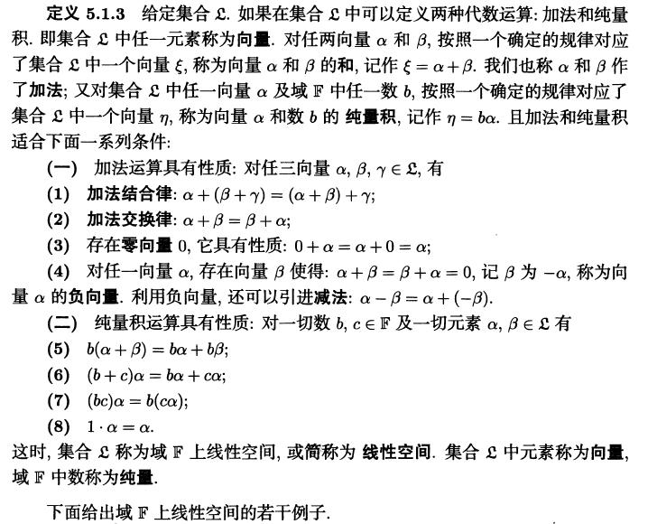
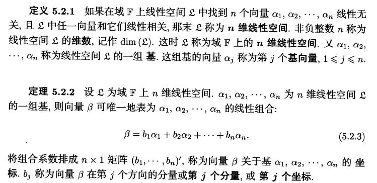

# 数学知识

- **线性代数**包括线性代数、概率论、高等数学、离散数学，夏令营面试中前两门课程最容易被问及。
- 在准备数学知识时，推荐重新复习**线性代数**和**概率论**，高等数学和离散数学可以直接背诵常见题目。
- **线性代数**中重要概念包括矩阵和向量的关系、线性相关、线性无关等。
- **概率论**中重要概念包括大数极限定律、中心极限定理、参数估计、概率分布等。

## 复习建议

### 线性代数
- 矩阵的秩表示矩阵的维度或列空间的维度，满秩代表每行都有主元，不满秩则至少有一行不存在主元。
- **线性相关**表示一组数据中有一个或多个量可以被其余量表示，**线性无关**则相反。
- **向量空间**具有加法结构和数乘结构，**线性空间**是具有线性运算规则的向量空间。

### 概率论
- **正态分布**是由大量微小、独立的随机因素叠加而成的随机变量分布。
- **正定矩阵**的特征是所有特征值大于零，各阶主子式大于零。

## 常见数学问题

### 线性代数
1. **矩阵的秩**：表示矩阵的维度或列空间的维度，满秩代表每行都有主元。
2. **线性相关与线性无关**：线性相关表示可以被其他量表示，线性无关则相反。
3. **向量空间与线性空间**：具有加法和数乘结构的集合称为线性空间，向量空间是线性空间的特例。

### 其他数学问题
- **正定矩阵**：特征值大于零且各阶主子式大于零。
- **矩阵范数**：满足非负性、齐次性、三角不等式和相容性的函数。

# 矩阵与特征值
- 若矩阵A的特征值均为正数，则A是正定的；若特征值均为负数，则A为负定的。
- 计算矩阵A的各阶主子式，若主子式均大于零，则A是正定的；若奇数阶主子式为负，偶数阶为正，则A为负定的。

# 矩阵范数
- **矩阵范数**是一个满足非负性、齐次性、三角不等式以及相容性的函数。
- 矩阵一范数是矩阵所有元素取绝对值，然后求最大列和。
- 矩阵A的2范数是“矩阵A的转置与矩阵A相乘所得矩阵”的最大特征值。

# 矩阵的特征值与特征向量
- **特征向量**是矩阵作用于该向量后，向量保持方向不变，进行某一比例的伸缩变换，而这个比例就是**特征值**。
- 特征值与特征向量的关系是，特征向量与特征值进行数乘操作后所得的向量，和矩阵对该向量进行变换所得向量相同。

# 矩阵运算下的解
- 线性方程组Ax=b的充要条件是，系数矩阵A和增广矩阵B的秩相等。
- 当线性方程组有解时，在m>=r=rank(A)的情况下，其通解依赖于m-r个独立参数，当m=r时具有唯一解。

# 张量与矩阵
- **张量**可以看作标量、向量、矩阵的推广，矩阵是二阶张量，而标量是0阶张量、矢量是1阶张量。

# 概率论
- **随机变量**是用来量化随机事件的函数，能够描述随机现象并通过概率统计进行分析。
- **概率分布**描述了随机变量的统计规律性，已知分布函数可以得知随机变量落在某一区间的概率。
- **联合概率**是基于两个随机变量及其相互作用的样本空间的概率，而**边缘概率**是多维随机变量的子空间的概率。

# 大数定律与中心极限定理
- **大数定律**指出随机试验次数充分大时，样本均值趋近于总体均值，样本频率稳定于概率。
- **中心极限定理**表明独立同分布的随机变量之和的标准化变量在n充分大时近似服从标准正态分布。

# 正态分布的性质
- 彼此独立的正态分布的和仍然是正态分布，这叫做**正态分布的可加性**。

# 正态分布相关知识点

## 中心极限定理
- **中心极限定理**：独立同分布的n个随机变量的算术平均值，在n充分大时近似服从均值为u，方差为sigma^2/n的正态分布。

## 李雅普诺夫定理
- **李雅普诺夫定理**：独立的n个随机变量，其随机变量之和的标准化变量很大时近似服从标准正态分布。

## 棣莫弗-拉普拉斯定理
- **棣莫弗-拉普拉斯定理**：正态分布是二项分布的极限分布。

## 正态分布的可加性
- **正态分布的可加性**：彼此独立的正态分布的和仍然是正态分布，多个独立同分布的正态随机变量的和也服从正态分布。

## 数学期望和方差
- **数学期望**：描述随机变量的集中特性，是随机变量每个取值与该取值的概率的乘积的累加和。
- **方差**：描述随机变量的波动特性，是随机变量每个取值和数学期望的偏差平方和与该取值的概率的乘积的累加和。

## 概率密度函数
- **概率密度函数**：连续随机变量的取值充满整个样本空间，无法用分布列表示，采用概率密度函数表示，反映随机变量在某点附近取值的概率大小。

## 相关系数和协方差
- **相关系数和协方差**：协方差描述两个随机变量的线性相关关系，相关系数是标准化的协方差，取值范围在[0,1]。
- **相关系数或协方差为0时**：不能说明两个分布无关，而是表示它们不呈线性相关关系。

## 全概率公式和贝叶斯公式
- **全概率公式**：用于计算达到某个目的的概率，考虑多种方式或原因。
- **贝叶斯公式**：在已知条件概率和全概率的基础上，计算导致某结果的各原因的可能性。

## 极大似然估计
- **极大似然估计**：利用已知样本结果信息，反推最有可能导致这些结果出现的模型参数值。

以上是正态分布相关的重要知识点。

# 参数估计方法

参数估计方法包括以下几个方面：

1. **无偏性**：估计量求出来的参数可能偏高可能偏低，但总体的平均值等于未知参数 $\theta$。
2. **有效性**：所估计出的参数在所构造的估计量中的方差要尽量小，即在参数 $\theta$ 附近的分散程度要小。
3. **一致性**：当样本容量无限增大时，估计量能在某种意义下充分接近于被估计的参数。
4. **区间估计**：点估计有一定的精度，如果要反映出精度可以采用区间估计。即在某个区间内取得参数 $\theta$ 的概率（即>=置信度）。

区间估计的概念是指，利用伯努利大数定律，一个区间以一定的概率包含参数 $\theta$，当试验次数无穷大时，频率接近于置信度。区间的长度意味着误差，与点估计互补，且与精度相互矛盾，精度越大，区间长度越小。

### 集合论基础知识

- **有穷集**：指能够和自然数集建立一一映射的集合。
- **等势集合**：指能够建立一一映射的两个集合，即大小相同的集合。
- **康托定理**：指一个集合的幂集都大于当前集合。

### 距离公式及缺点

- **欧氏距离**：表示n维空间中两点之间的线段长度。
- **欧氏距离的缺点**：受数据尺度影响，需要进行数据归一化。
- **余弦相似距离**：只考虑数据方向，受数据尺度影响较大。
- **曼哈顿距离**：街道距离，不够直观且非最短距离。

### 最大似然估计

- **最大似然估计**：根据某一样本值出现的概率较大，认为使得该样本值概率最大的参数值较合理。

### 梯度、梯度下降及导数

- **导数**：针对一元函数的概念，表示函数对自变量的导函数。
- **偏导数**：针对多元函数，表示函数对某一自变量的导函数。
- **梯度**：表示方向上的最大变化率，由各个偏导数组成的向量。
- **梯度下降**：沿负梯度方向减小函数值以达到优化目标。

### 复合函数求导及导数与偏导数的区别

- **复合函数求导**：使用链式法则，各函数导数的乘积表示。
- **导数**：针对一元函数，又称微商；**偏导数**：针对多元函数的导函数。

### 可导、可微、连续、可积关系

- **一元函数**：可微和可导互为充分必要条件，连续必可积，可积不一定连续。
- **二元函数**：可微必连续，连续不一定可微，连续必可积，可积不一定连续。

### 三个中值定理及函数阶

- **罗尔中值定理**：端点函数值相等时导数为0；**拉格朗日中值定理**：导数等于端点连线斜率；**柯西中值定理**：两函数导数比值等于函数值差比值。
- **函数阶**：表示函数的次数或无穷小程度。

### 群、环、域的定义

- **群**：可结合的二元运算系统，存在单位元和逆元。
- **环**：存在加法和乘法运算，满足交换群和分配律。
- **域**：环的乘法满足交换律，存在单位元且非零元素乘积非零。

以上是教材中提到的部分重要知识点。

# 群环域的定义
由一个非空集合$S$和该集合上的$k$个运算组成的系统称作代数系统。群是一个特殊的代数系统，其运算是可结合的二元运算，并且系统中存在单位元和逆元。

环：若一个代数系统存在两个运算$1$和$2$，集合$R$关于运算$1$构成交换群，关于运算$2$构成半群，并且运算$2$关于运算$1$适合分配律，则集合$R$和这两个运算构成的代数系统称作环。其中称运算$1$为加法，运算$2$为乘法。

域：如果一个环的乘法运算符合交换律，并且关于乘法运算存在单位元，并且对于环中的任意两个非零元素执行乘法操作结果均不为$0$，那么这个环$R$构成一个域。

参考：《离散数学屈婉玲》181页

# 离散型随机变量
- 0-1分布：用于估计样本空间只有$0$、$1$两个值的独立重复实验的概率。
- 二项分布：常用于样本空间只有两个值的独立重复实验的概率计算。
- 泊松分布：常用于服务系统，预测某一天某时段某服务台到达人数。
- 几何分布：在$n$次伯努利试验中，试验$k$次才得到第一次成功的概率。
- 超几何分布：不放回抽样的概率计算。

参考：《浙大第四版概率统计》

# 欧拉图和哈密顿图
- **欧拉图**包含欧拉回路，即能够通过图中所有的边一次且仅一次通过所有顶点的回路。
- **哈密顿图**是经过所有顶点一次且仅一次的图。

欧拉图可以通过Hierholzer算法或Fleury算法求解，而哈密顿图求解较为困难，通常使用启发式搜索算法求出近似精确解，如禁忌搜索算法、蚁群算法、遗传算法等。

参考：https://blog.csdn.net/qq_40493829/article/details/108253637，https://blog.csdn.net/guomutian911/article/details/42105127

# 欧拉图和欧拉函数
- **欧拉图**包含欧拉回路，即能够通过图中所有的边一次且仅一次通过所有顶点的回路。
- **欧拉函数**是数论中的概念，定义为对自然数$n$，从$0$到$n-1$中与$n$互素的数的个数。

参考：《离散数学屈婉玲》316页

# 哈夫曼树
**哈夫曼树**又称最优二叉树，是一组使得带权路径长度最短的权重配置方案作为权重的二叉树。其基本思想是带权路径长度最小的二叉树应该是权值大的外结点离根节点最近的扩充二叉树。

计算方法：通过选择树根权值最小的两个树，创建新树，重复这一过程直到只剩一个树为止。

应用：编码设计中的Huffman编码、决策算法、算法设计等。

参考：《数据结构殷人昆第二版》241页

# 无向图的定义
**无向图**是一个有序二元组，由一个非空有穷集（顶点集）和一个由顶点集的有序积的有限多重子集（边集）构成。无向图的边表示顶点和顶点的连接关系，边是无序的，不同于有向图的边只表示单向关系。

参考：《离散数学屈婉玲》273页

# 等价关系和等价类
如果非空集合$A$上的一个关系$R$同时满足自反性、对称性和传递性，则称$R$为集合$A$上的等价关系。等价类是集合$A$中所有与$x$等价的元素构成的集合。

参考：《离散数学屈婉玲》123页

# 极限与连续性
- 极限存在但不一定连续，连续必须在点上有定义，但是极限科研没有定义，连续一定存在极限。
- 连续存在必须满足的三个条件：a. 在该点有定义；b. 极限存在且等于函数值。

# 间断点类型
- 第一类间断点：a. 跳跃间断点（左右极限存在且相等）；b. 可去间断点（在该点无定义）。
- 第二类间断点：无穷间断点（左右极限至少有一个不存在）。

# 介值定理
闭区间$[a,b]$上连续的函数一定存在一点$x$属于该区间使得$f(x)=c$，其中$c$介于$f(a)$和$f(b)$之间。介值定理也称为零点定理。

参考：《离散数学屈婉玲》